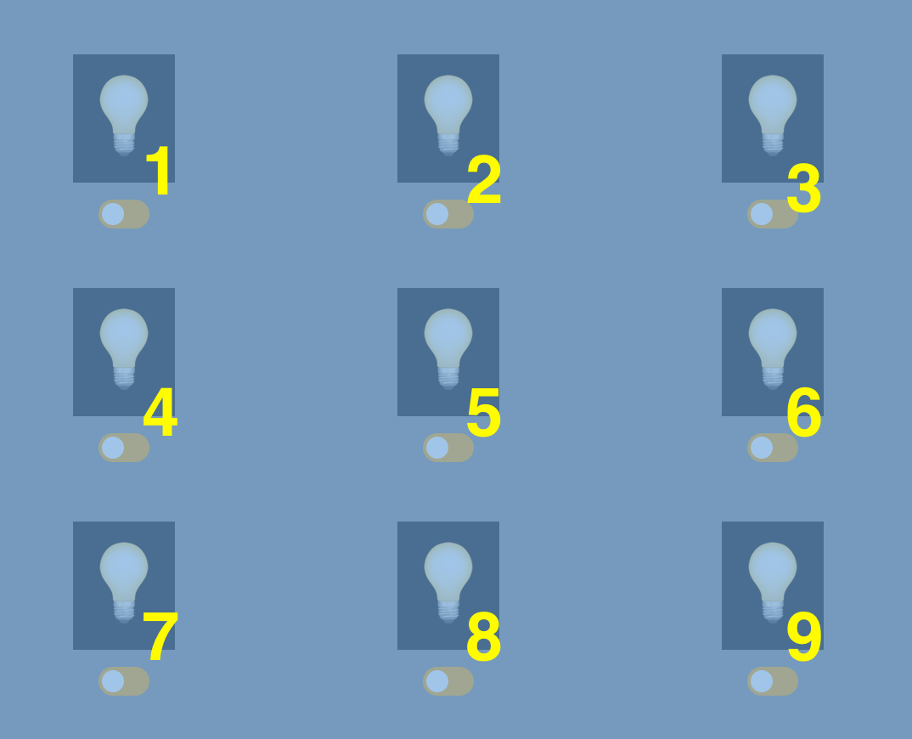

# The Cross-Wired Lightbulbs Puzzle

### Teacher Notes

In this lessons students wil be using add, remove, and toggle to connect switch checkboxes with purposely mismatched lights. They will be toggling a class name that, when added, illuminates the light box.

It will feel weird and wrong purposefully mismatching switches with lights, but reiterate that students should be zoned in on the routing list in #6. The directions go through the routing of the first switch which you may want to do with students if you see many of them are struggling. Then, students are expected to repeat the pattern for the other routings.

This lab will not conclude as an accessible one. However, the exemplar is accessible, and feel free to encourage students to explore ways to make the site accessible as a spicy extension.

### Prompt

The goal is simple, turn on all the lights! That would be simple if every switch turned on the single light that was above it. However, almost every switch in this lab does just the opposite of what you would expect. First, you'll have to do something evil and program the lights to be mismatched, then you will try to get all of them on. After, in the extensions, there will be some fun ways to spice up the challenge. 

**Directions**: There are 9 lights as numbered in the image below. The steps below will guide you to connect `switch 1` with `light 3` and `light 8`. Then, follow the same pattern to connect the other switches as indicated below.



1. Let's connect the first switch. This can be broken down into 3 steps:
    - use `querySelector()` to get the element of the 1st switch with an `id="switch1"`,
    - create a function that uses `querySelector()` to get the element of light 3 and 8 (with `id="lightbulb3"` and `id="lightbulb8"`) and switch their current state. In other words, if the light is on turn it off, and if it's off then turn it on,
    - use `addEventListener()` to call the function when the switch is "flicked"

2. First, use `querySelector()` to get the element of the 1st switch.  Save it into a variable called "switch1". It should look as follows:
    ```js
    const switch1 = document.querySelector("#switch1");
    ```

3. Next, create a function called `change38` and get the elements for lightbulb 3 and 8. 
    ```js
    const change38 = () => {
        const light3 = document.querySelector("#lightbulb3");
        const light8 = document.querySelector("#lightbulb8");
    }
    ```
4. Then, in that same function, use add and remove or toggle to switch the attribute **"active"**. There's more than 1 right way to do this. Just make sure you switch both lights!

5. Finally, add an event listener for the switch that calls the function `change38`.
    ```js
    switch1.addEventListener('change', change38);
    ```

6. Now, continue to route lights as indicated below
    - **switch1**: lightbulb3, lightbulb8
    - **switch2**: lightbulb1, lightbulb7
    - **switch3**: lightbulb4, lightbulb6, lightbulb8
    - **switch4**: lightbulb2, lightbulb9
    - **switch5**: lightbulb5
    - **switch6**: lightbulb1, lightbulb4
    - **switch7**: lightbulb2, lightbulb3
    - **switch8**: lightbulb5, lightbulb9
    - **switch9**: lightbulb6, lightbulb7
    
7. Great, you did it! If you did it right, all your switches should be... wrong. Switch #5 should be the only switch working correctly. Take a moment to try and get all the lights to turn on!

### Exemplar

Take a look at this [finished example](./U2LAB4-Exemplar/index.html) before you start to get an idea of what your fan page might look like.

### Culturally Responsive Best Practice

We find that a light switch is a good, generic example of applying toggle in javascript, but students may have a hard time seeing how else this can be applied on a website. [This website](https://codemyui.com/tag/toggle-switch/) is a good starting point to have students begin recognizing the use of toggle, but encourage students to explore other websites to identify toggle in a place that's more familiar to them. Places may include: emails, social media accounts, phone's settings/control center, music making applications, and more.

### Extra Help?

Here is a good video resource for [examples using add, remove, and toggle](https://www.youtube.com/watch?v=FKQkx-wGexo). 

If you forget how to implement conditional if/else statements, here's the [w3schools resource](https://www.w3schools.com/js/js_if_else.asp) on examples of that.

<details>
<summary>Click here for the answer key to the puzzle</summary>
<br>

_Click on switches 2, 3, 7, and 8 to turn on all the lights_

</details>

### Extensions

**Mild**:

- `switch5` makes the puzzle too easy. Change it so that it changes 5 and any other lightbulb except 9. For example, 7: the switch should then call `change57` and the old function should now toggle both _light #5_ and _light #7_. 

**Medium**

- Add a master switch that toggles all the lights. The switches should be left in their current state.
- Add a "restart" button that turns all toggles orange and all lights off. 

**Spicy**

- Add a "randomize" button that restarts the game and turns on 3 random lights (all toggles should be orange). HINT: use [Math.random()](https://developer.mozilla.org/en-US/docs/Web/JavaScript/Reference/Global_Objects/Math/random) and some `if else` statements to determine which lights will be initialized to `on`.
- Let **green** `rgb(0, 255, 0)` be the color of success in this game aka when all 9 lights are on. Let **purple** `rgb(255, 0, 255)` be the color from when the game starts. 
    - Go into the `style.css` and change the background to the purple RGB. The property is in the ruleset for the id `#wrapper`.
    - In the `script.js`, code it so that every time a light goes on, the R and B values drop by 28, and the G value increases by 28. (For example: from `rgb(255, 0, 255)` to `rgb(227, 28, 227)`)
    - When ever a light goes off, the opposite should happen. (For example: `rgb(143, 112, 143)` to `rgb(171, 84, 171)`)
    - If you do this correct, the color should switch from purple to gray (when the puzzle is half way complete) to green. 

**Reflection Questions:**

- Clicking switches and seeing lights appear will be inaccessible to someone who cannot see. What are some ways that you can make this website accessible? 
- What else can be added to a website like this to improve it?
- What was the biggest challenge you faced while going through this lab? 